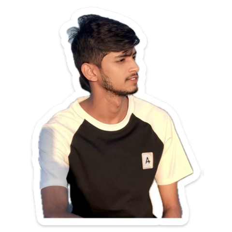

<h1 align="center">Hello, I am Pankaj Kumar Barai</h1>

###

<h2 align="left">💫 About Me</h2>

###

  

###

###

Hi, I'm Pankaj Kumar Barai, a passionate Web Developer with a diploma in Computer Engineering. I enjoy building interactive web applications and exploring Python for problem-solving.  💼 Projects: - To-Do List App - Basic Chatbot using APIs - E-Commerce Website

###

 

💡Tech Stack: JavaScript | PHP | Python | C++ | HTML | CSS | Tailwind CSS | MySQL | Java | C | DSA  🌱 Currently learning: DSA using Java and React.js 🎯 Goal: Full Stack Web Developer  📫 Let’s connect: baraipankajkumar146@gmail.com

###

<h3 align="left">Connect with me ✨</h3>

###

  
  
  
  
  
  

###

<h3 align="left">Tech skills I have 🧑‍💻</h3>

###

  
  
  
  
  
  
  
  
  
  
  
  
  
  
  
  
  
  
  
  
  
  
  
  
  

###

<h3 align="center">Github Status</h3>

###

 

  
  
  
  
  

###
